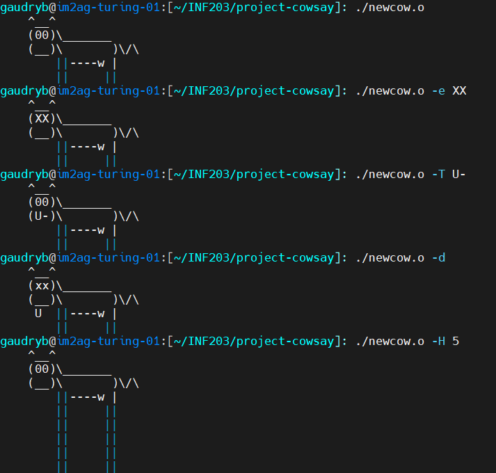
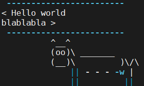

# Projet cowsay - INF203

Ben Gaudry - Remi Cortial - IMA03

## Préliminaires

Les différentes options de la commande cowsay sont : 

| Option de commande | Effet de la commande                                                                |
|--------------------|-------------------------------------------------------------------------------------|
| -e <txt>           | Change le texte représentant les yeux de la vache                                   |
| -f {file}          | Prend le texte représentant la vache dans un fichier                                |
| -T {txt}           | Change le texte représentant la langue de la vache                                  |
| -W {nb}            | Donne un nombre maximal de colonnes de texte avant que le texte ne passe à la ligne |
| -b                 | Borg mode                                                                           |
| -d                 | La vache apparaît morte                                                             |
| -g                 | La vache apparaît avare                                                             |
| -p                 | La vache apparaît paranoiaque                                                       |
| -t                 | La vache apparaît fatiguée                                                          |
| -w                 | La vache apparaît très réveillée                                                    |
| -y                 | Les yeux de la vache deviennent très petits                                         |

## Bash
Tous les scripts se trouvent dans /cow_scripts/{nom_du_script}.sh.

Il est possible de tester les scripts avec le fichier test.sh mais il est 
nécessaire d'effectuer d'autres tests plus poussés au cas par cas

### Crazy cow
Pour ce script, nous avons choisi de réaliser une vache qui calcule la ou les solutions d'une équation du second degré

## C
Nous avons mis en place un fichier Makefile pour compiler le code simplement. 
Il faut donc utiliser la commande `make` pour compiler le code et la commande `make clean` pour supprimer les fichiers compilés.

Ensuit, il suffit d'exécuter les fichiers avec 
```shell
cd ./c
./newcow.o [options]
./wildcow.o [options]
./reading_cow.o [options]
./crazycow.o [options]
```

### Outputs

Voici quelques tests que nous avons réalisé :

(si les images ne s'affichent pas, voir dans le dossier __/assets__, ou voir sur [github](https://github.com/bengaudry/project-cowsay/blob/main/compte_rendu.md))

__newcow.c__



__reading_cow.c__

En exécutant la commande 
```shell 
./reading_cow.o testfile.txt
```
on obtient à la fin ce résultat :



Le fichier __crazycow.c__ est animé donc impossible à montrer avec une image.

### Crazy cow
Pour utiliser la fonctionnalité de vache animée sur le script crazy cow, il faut 
utiliser la commande
```shell
./crazycow.o --wild
```

# Automates
Voir fichier __c/tamagoshi.c__

Pour la partie automate nous avons choisi de définir les 3 états de notre Tamagoshi, puis une fonction transition en utilisant "switch" qui va modifier l'état en fonction de la valeur de la variable "fitness", selon l'énoncé.
On aurait pu utiliser un type structuré comme vu dans certains TP mais on s'est rendu compte que ce n'était pas forcément utile étant donné qu'il n'y avait que 3 états et assez peu de transitions.
À chaque changement d'état, la vache est affichée selon son état de santé, le stock de nourriture est affiché et l'utilisateur doit choisir la quantité de nourriture à donner.
